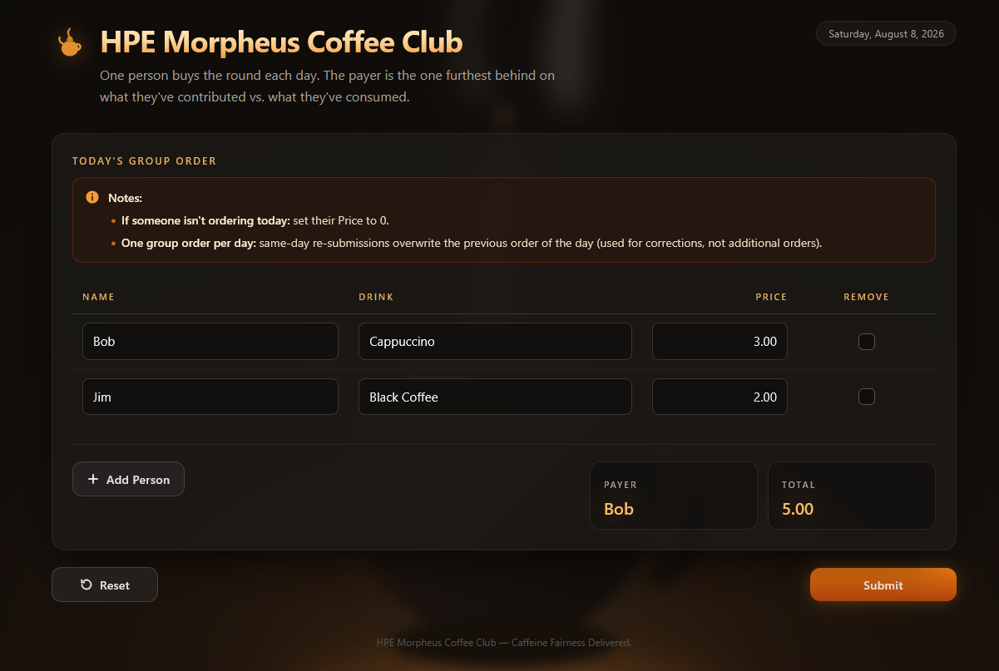
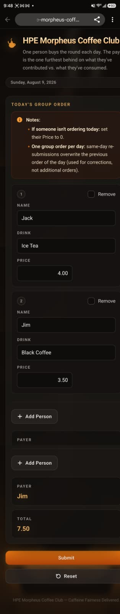
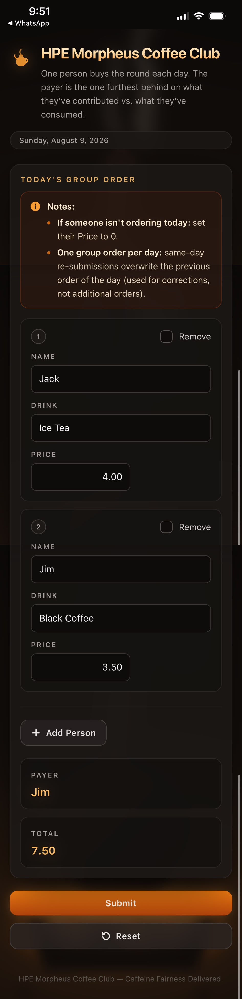

# HPE Morpheus Coffee Club

A mobile-first, fully responsive single-page web application for a small team that takes turns
buying the daily coffee round.

Drinks do not all cost the same, so taking strict turns is not actually fair. Instead the app keeps
a lifetime ledger for every coworker and picks the person who is furthest behind:

```
net difference = (total they have paid for the group) - (total cost of the drinks they have consumed)
```

Among everyone ordering today, the lowest net difference pays. A tie goes to whoever appears first
in the table. Someone with no history starts at `0.00`.

## 🚀 Live Demo

Experience the live web application here: **[hpe-morpheus-coffee-club.onrender.com](https://hpe-morpheus-coffee-club.onrender.com/)**

- **Note:** the app is hosted on Render cloud (free plan) which might result in it loading slowly
  initially:
  - Free plan instances on Render spin down after ~15 minutes of inactivity, so the next visitor
    waits 50–60 seconds for a cold start.

## Cross-Platform UI Previews

<table>
  <tr>
    <th colspan="2">Desktop</th>
  </tr>
  <tr>
    <td colspan="2" align="center">
      <a href="frontend/public/preview.png"></a>
    </td>
  </tr>
  <tr>
    <th width="50%">Android</th>
    <th width="50%">Apple</th>
  </tr>
  <tr>
    <td align="center">
      <a href="frontend/public/preview_Android.png"></a>
    </td>
    <td align="center">
      <a href="frontend/public/preview_Apple.png"></a>
    </td>
  </tr>
</table>

- **Note:** Each preview is also served by the running app — `/preview.png`,
  `/preview_Android.png` and `/preview_Apple.png` (for example
  <http://localhost:5173/preview.png> in dev) — which makes them easy to share.

---

## Table of Contents

- [HPE Morpheus Coffee Club](#hpe-morpheus-coffee-club)
  - [🚀 Live Demo](#-live-demo)
  - [Cross-Platform UI Previews](#cross-platform-ui-previews)
  - [Table of Contents](#table-of-contents)
  - [Features](#features)
  - [Technology Stack](#technology-stack)
  - [Project Structure](#project-structure)
  - [How the Group Order Page Works](#how-the-group-order-page-works)
  - [Data Model](#data-model)
  - [API Reference](#api-reference)
  - [Assumptions](#assumptions)
  - [Build and Run](#build-and-run)
    - [Prerequisites](#prerequisites)
    - [Deployment Profiles](#deployment-profiles)
      - [1. Dev — Local Instance ideal for coding with hot reload](#1-dev--local-instance-ideal-for-coding-with-hot-reload)
      - [2. Prod](#2-prod)
        - [a) Standalone Executable JAR](#a-standalone-executable-jar)
        - [b) Cloud Deployment (Render)](#b-cloud-deployment-render)
  - [Testing](#testing)
  - [Troubleshooting](#troubleshooting)

---

## Features

- **Pre-populated group order** — the table opens with everyone from the previous order, their last
  drink and their most recent non-zero price, sorted alphabetically.
- **Live payer selection** — the Payer field resolves as soon as every row is valid, and updates
  instantly as prices change.
- **Live total** — recalculated on every keystroke, always formatted to two decimal places.
- **Remove a coworker** — ticking Remove zeroes the price (and restores it if unticked). Once
  submitted, that person never pre-populates again, but their history is kept so re-adding them
  restores their balance.
- **Strict server-side validation** — every rule is enforced again on the backend, which returns
  per-row, per-field error detail that the UI highlights in place.
- **Persistent history** — file-backed H2, so restarting the server keeps the ledger intact.

---

## Technology Stack

| Layer      | Technology                                                        |
| ---------- | ----------------------------------------------------------------- |
| Backend    | Spring Boot 4.1 (Spring Framework 7), Java 25                     |
| Persistence| Spring Data JPA / Hibernate 7, H2 with local file persistence      |
| Validation | Jakarta Bean Validation (Hibernate Validator)                      |
| Frontend   | React 19, Vite 8, TypeScript 5.9, Tailwind CSS 4                   |
| Tests      | JUnit 5, AssertJ, Mockito, Spring MockMvc                          |
| Build      | Maven                                                              |
| Container  | Multi-stage Docker (Node → JDK → JRE)                              |

---

## Project Structure

```
hpe-morpheus-coffee-club/
├── pom.xml                       Maven build; 'prod' profile builds and embeds the frontend
├── Dockerfile                    3-stage image for Render ('prod-cloud')
├── render.yaml                   Render blueprint
├── data/                         H2 database files (created at runtime, git-ignored)
│
├── src/main/java/com/hpe/morpheus/coffeeclub/
│   ├── CoffeeClubApplication.java
│   ├── config/                   Clock bean and seed data
│   ├── controller/               REST API, SPA forwarding, global error handling
│   ├── dto/                      Request/response records with validation constraints
│   ├── entity/CoffeeOrder.java   Maps to hpe_morpheus_coffee_club
│   ├── exception/
│   ├── repository/
│   └── service/                  Balances, payer selection, order persistence
│
├── src/main/resources/
│   ├── schema.sql                Table DDL, in the agreed column order
│   ├── application.yml           Shared config; server.port = ${PORT:8080}
│   ├── application-dev.yml
│   └── application-prod.yml
│
├── src/test/java/                JUnit suite (63 tests)
│
└── frontend/
    ├── vite.config.ts            Dev server on 5173, proxies /api/* to 8080
    └── src/
        ├── api/                  Typed fetch client
        ├── components/           Page, table, fields, summary, background art
        ├── styles/
        │   ├── index.css         Tailwind entry point and base layer
        │   └── coffeehouse.css   All shared/repeating style elements
        ├── utils/orderLogic.ts   Validation, totals and payer preview
        └── types.ts
```

---

## How the Group Order Page Works

**The table** opens pre-populated from the previous order:

| Column   | Behaviour                                                                                                        |
| -------- | ---------------------------------------------------------------------------------------------------------------- |
| Name     | Carried over from the most recent order. Required.                                                                |
| Drink    | The drink from that person's most recent order. Required.                                                         |
| Price    | The most recent price **greater than zero** for that person anywhere in their history, else `0.00`. Required.      |
| Remove   | Unticked by default. Ticking it sets Price to `0.00`; unticking restores the previous price.                       |

If there is no history at all, only the header row is shown.

**Add Person** (below the table, left) appends an empty row: blank Name, blank Drink, price `0.00`,
Remove unticked.

**Payer** (below the table, right) shows `TBD (Fill all fields to calculate)` until every row passes
validation, then shows who is buying. Default values — price `0.00` and Remove unticked — count as
filled.

**Total** (below the table, right) is the sum of every row that is not flagged for removal.

**Submit** (bottom right) validates and saves. The payer's row is stored with the whole group total
in `total_paid_today`; everyone else gets `0.00`.

> Note: If someone isn't ordering today, set their Price to 0.

---

## Data Model

Table `hpe_morpheus_coffee_club` — one row per person per order date. The DDL is in
[`src/main/resources/schema.sql`](src/main/resources/schema.sql).

| Column             | Java field        | Type            | Notes                                            |
| ------------------ | ----------------- | --------------- | ------------------------------------------------ |
| `id`               | `id`              | `BIGINT`        | Surrogate key (not part of the coworker data)     |
| `order_date`       | `orderDate`       | `DATE`          | The day the round was bought                      |
| `name`             | `name`            | `VARCHAR(60)`   | Matched case-insensitively across history         |
| `drink`            | `drink`           | `VARCHAR(80)`   |                                                   |
| `price`            | `price`           | `DECIMAL(8,2)`  | Cost of this person's own drink; `0.00` = not ordering |
| `total_paid_today` | `totalPaidToday`  | `DECIMAL(10,2)` | Group total for the payer, `0.00` for everyone else |
| `is_removed`       | `isRemoved`       | `CHAR(1)`       | `Y` / `N`                                          |

**Seed data** — on first startup against a blank database, two records dated yesterday are inserted:

| order_date | name | drink        | price | total_paid_today | is_removed |
| ---------- | ---- | ------------ | ----- | ---------------- | ---------- |
| yesterday  | Bob  | Cappuccino   | 0.00  | 0.00             | N          |
| yesterday  | Jim  | Black Coffee | 0.00  | 0.00             | N          |

The database lives at `./data/coffeedb.mv.db` (`jdbc:h2:file:./data/coffeedb`) and survives
restarts. Delete the `data/` folder to start over from the seed records.

---

## API Reference

| Method | Path                          | Purpose                                                    |
| ------ | ----------------------------- | ---------------------------------------------------------- |
| `GET`  | `/api/orders/prepopulate`     | Rows for the table plus lifetime balances for the UI preview |
| `GET`  | `/api/orders/balances`        | Lifetime paid / consumed / net difference per coworker       |
| `POST` | `/api/orders`                 | Validate and save today's round; returns payer and total     |

Errors come back as:

```json
{
  "timestamp": "2026-08-07T12:00:00Z",
  "status": 400,
  "message": "Please correct the highlighted fields and try again.",
  "fieldErrors": [{ "lineIndex": 0, "field": "price", "message": "Price cannot be negative." }]
}
```

`lineIndex` is the zero-based table row, so the UI can highlight the exact cell.

---

## Assumptions

To keep the development within reasonable time limits the following assumptions were made:

1. Prioritized polished front-end UI over front-end testing and rely on the back-end validation
   instead. However in regular production intended deployments I would go with Playwright for the
   end to end testing.
2. Tax calculations and additions were not incorporated.
3. Historical order changes/corrections not catered for.
4. **One group order per day:** same-day re-submissions overwrite the previous order of the day
   (used for corrections, not additional orders). Orders from previous days are immutable (per
   Assumption 3).

A few smaller decisions that follow from the requirements are worth calling out:

5. A submission in which nobody is ordering (every price `0.00`, or everyone removed) is rejected,
   because there is no round to pay for and therefore no payer to select.
6. Names are matched case-insensitively and with whitespace collapsed, so `bob`, `Bob` and `Bob `
   all resolve to the same person's lifetime history.

---

## Build and Run

### Prerequisites

| Tool   | Version                                                      |
| ------ |--------------------------------------------------------------|
| JDK    | 25 (or any JDK 17+)                                          |
| Maven  | 3.9+                                                         |
| Node.js| 22+ with npm 10+ (only needed for the `dev` workflow)        |
| Docker | Only needed for `prod-cloud`                                 |

The `prod` Maven profile downloads its own Node/npm, so a local Node install is not required there.

---
### Deployment Profiles
The application supports different profiles depending on your target environment:

#### 1. Dev — Local Instance ideal for coding with hot reload

Frontend and backend stay completely decoupled. Run each in **its own terminal**.

**Terminal 1 — Spring Boot backend on port 8080:**

```bash
mvn clean spring-boot:run "-Dspring-boot.run.profiles=dev"
```

`clean` costs a few seconds and keeps consecutive runs pristine: it clears compiled classes for
source files you have since deleted, and any static frontend bundle left in `target/classes/static`
by an earlier `-Pprod` build. It does **not** touch the database — `data/` lives in the project
root, not in `target/`.

**Terminal 2 — Vite dev server on port 5173:**

```bash
npm install --workspace=frontend
```

```bash
npm run dev --workspace=frontend
```

Then open <http://localhost:5173>.

- Vite proxies every `/api/*` request to `http://localhost:8080` (configured in
  [`frontend/vite.config.ts`](frontend/vite.config.ts)). The browser only ever talks to
  `localhost:5173`, so requests are same-origin and **no CORS configuration is needed anywhere**.
- Full Hot Module Replacement: saving a `.tsx` or `.css` file updates the browser instantly without
  losing the state of the table.
- The H2 console is available at <http://localhost:8080/h2-console> in this profile. Log in with
  JDBC URL `jdbc:h2:file:./data/coffeedb;AUTO_SERVER=TRUE`, user `sa`, empty password. The
  `AUTO_SERVER=TRUE` part matters — without it the console cannot open the database file while the
  application is running.

---

#### 2. Prod
The application can be deployed for production using the following options:

##### a) Standalone Executable JAR
One command produces a single JAR that serves both the API and the compiled React UI on port 8080:

```bash
mvn clean package -Pprod
```

The `prod` profile:
1. Installs a pinned Node/npm into `target/` (no global install needed).
2. Runs `npm install` and `npm run build` inside `frontend/`.
3. Copies `frontend/dist` into `target/classes/static`.
4. Packages everything into `target/hpe-morpheus-coffee-club-1.0.0.jar`.

Run it:

```bash
java -Dspring.profiles.active=prod -jar target/hpe-morpheus-coffee-club-1.0.0.jar
```

Then open <http://localhost:8080>.

To run on a different port:

```bash
java -Dspring.profiles.active=prod -DPORT=9090 -jar target/hpe-morpheus-coffee-club-1.0.0.jar
```

> A plain `mvn clean package` (without `-Pprod`) builds and tests the backend only — useful for a
> fast backend-only loop.

---

##### b) Cloud Deployment (Render)
[Render](https://render.com) offers a [free plan](https://render.com/docs/free) that is excellent for hosting small applications and demos.

> ⚠️ **Note:** with the Render Free Tier, the instances automatically spin down after approximately 15 minutes of inactivity. The next incoming request will trigger a cold start, causing a delay of 50–60 seconds while the container boots back up. This is standard behavior for free hosting tiers.

The root [`Dockerfile`](Dockerfile) builds the whole application in three stages:

| Stage | Base image                       | Does                                                        |
| ----- | -------------------------------- | ------------------------------------------------------------ |
| 1     | `node:22-alpine`                 | Builds the React production bundle                            |
| 2     | `maven:3.9-eclipse-temurin-25`   | Compiles Spring Boot, injecting stage 1's static output       |
| 3     | `eclipse-temurin:25-jre-alpine`  | Minimal JRE runtime that executes the standalone JAR          |

The application reads Render's injected `PORT` environment variable and falls back to `8080`
(`server.port: ${PORT:8080}` in `application.yml`), so the web service boots without extra config.

**Build and run locally:**

```bash
docker build -t hpe-morpheus-coffee-club .
```

```bash
docker run --rm -p 8080:8080 -e PORT=8080 hpe-morpheus-coffee-club
```

**Deploy to Render:**

1. Push this repository to GitHub.
2. In Render, choose **New → Web Service** and connect the repository.
3. Select **Docker** as the runtime — Render picks up the root `Dockerfile` automatically.
   (Alternatively use **New → Blueprint** and Render will read [`render.yaml`](render.yaml).)
4. Leave the port blank; Render injects `PORT` and the app honours it.
5. Deploy. Every push to the tracked branch triggers a rebuild.

**Additional things to keep in mind with the Render free plan:**
- The free filesystem is ephemeral, so the H2 file resets on restart and the app re-seeds Bob and
  Jim. Attach a persistent disk mounted at `/app/data` (see the commented block in `render.yaml`) to
  keep history across restarts.

---

## Testing

```bash
mvn test
```

Total of 63 JUnit tests covering:

| Suite                       | Covers                                                                                                  |
| --------------------------- |---------------------------------------------------------------------------------------------------------|
| `NamesTest`, `MoneyTest`    | Name matching rules and two-decimal money scaling                                                       |
| `BalanceCalculatorTest`     | Lifetime paid/consumed/net aggregation, case-insensitive merging, ordering                              |
| `PayerSelectorTest`         | Lowest net wins, ties, removed rows, zero prices, newcomers, nobody ordering                            |
| `CoffeeClubServiceTest`     | Pre-population rules, submission, removal tombstones, same-day replacement, multi-day fairness rotation |
| `CoffeeOrderControllerTest` | Every validation rejection and the exact error payload the UI relies on                                 |
| `DataInitializerTest`       | Seeds a blank database once and never re-seeds                                                          |
| `CoffeeClubIntegrationTest` | Full round trip against the real application context                                                    |

Frontend type checking (also run as part of `npm run build`):

```bash
npm run typecheck --prefix frontend
```

---

## Troubleshooting

**`PKIX path building failed` when Maven downloads dependencies.**
Your network intercepts TLS with a corporate root certificate that Java's own truststore does not
have. On Windows, point the JVM at the Windows certificate store for the build:

```bash
MAVEN_OPTS="-Djavax.net.ssl.trustStoreType=Windows-ROOT" mvn clean package -Pprod
```

**`Port 8080 was already in use`.**
Stop the other process, or run on a different port with `-DPORT=9090`.

**The UI loads but every request fails with 502 in dev.**
The Vite proxy is running but the backend is not. Start the backend first (terminal 1 above).

**I want to reset the ledger.**
Stop the app and delete the `data/` folder. The next startup re-seeds Bob and Jim.

**The H2 console says "Database may be already in use".**
The JDBC URL in the console's login form is missing `AUTO_SERVER=TRUE`. Use
`jdbc:h2:file:./data/coffeedb;AUTO_SERVER=TRUE`.
